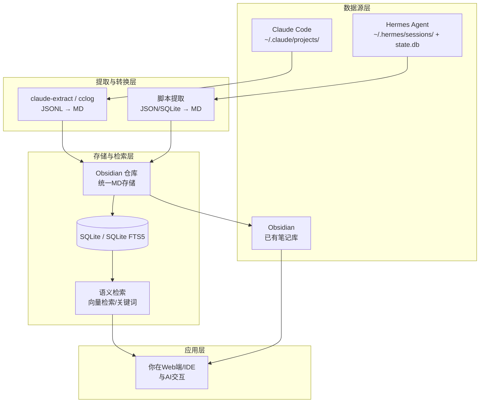

想把 Obsidian、Claude Code 和本地 Hermes Agent 三者的数据全部打通，最核心的思路是：**把这些工具的历史记录都转化成统一的 Markdown 格式，然后存入 Obsidian，再利用本地数据库做语义检索。**

下面为你整理了打通路径的方案：

### 🔁 打通路径图



### 📥 第一步：导出 Claude Code 的历史
桌面端的聊天记录虽无“导出”按钮，但都保存在本地 `~/.claude/projects/` 目录下的 `.jsonl` 文件里。

推荐使用专业的导出工具：
*   **推荐工具1：** `claude-conversation-extractor` (Python)
    *   一键导出：`claude-extract --all --format markdown`
    *   交互搜索：`claude-start`
*   **推荐工具2：** `cclog` (Go)
    *   TUI 界面方便浏览，支持直接在编辑器里打开。

导出的 Markdown 文件可直接保存到你的 Obsidian 仓库文件夹中。

### 🗄️ 第二步：定位 Hermes Agent 的数据
Hermes 的数据主要存三处，你可以按需提取：

*   **会话 JSON（完整日志）：**
    ```bash
    ls ~/.hermes/sessions/
    ```
*   **核心记忆（温记忆）：** 关键信息在 `~/.hermes/memories/`（USER.md 偏好，MEMORY.md 规则）。可以直接复制或软链接到 Obsidian 中管理。
*   **元数据（SQLite）：** 存放工具调用记录等。
    ```bash
    sqlite3 ~/.hermes/state.db "SELECT * FROM tool_calls LIMIT 10;"
    ```

### 🧠 第三步：让 Agent “看懂” Obsidian
要让你的 Agent 读取 Obsidian，需要提供一个接口。推荐轻量的 **Silver Searcher (`ag`)** 进行全文搜索，或构建本地向量库。

提供一个 Python 检索脚本，你可以运行它，或集成到 Agent 的工具调用里：

```python
import os, sqlite3, subprocess, json

# 1. 读取本地 Hermes 的长期记忆库
def get_hermes_memories():
    conn = sqlite3.connect(os.path.expanduser("~/.hermes/state.db"))
    # 这里假设你构建了记忆表，如果没有，直接读取 sessions 里的 JSON 文件也行
    cursor = conn.execute("SELECT content FROM long_term_memories ORDER BY importance DESC LIMIT 5")
    return [row[0] for row in cursor]

# 2. 使用 ripgrep 极速检索 Obsidian 笔记 (推荐)
def search_obsidian(query):
    vault_path = "~/path/to/your/obsidian-vault" # 改成你的路径
    # 使用 -i 忽略大小写，--json 方便解析
    cmd = ['rg', '--json', '-i', query, vault_path]
    result = subprocess.run(cmd, capture_output=True, text=True)
    return result.stdout

# 3. 整合记忆给 AI 使用
def build_context(user_query):
    context = {
        "hermes_memories": get_hermes_memories(),
        "relevant_notes": search_obsidian(user_query),
        "claude_logs": "最近导出的MD文件路径..." 
    }
    return json.dumps(context)

if __name__ == "__main__":
    print(build_context("我的 API Key 配置"))
```

### ✅ 第四步：尝试记忆框架（进阶）
如果上述基础脚本满足不了需求，可以考虑引入第三方的开源记忆框架。例如 **MemVerse**，它支持多模态（图文音）和“记忆蒸馏”技术，能让你的 Agent 记忆能力有质的飞跃。

### 💡 几点补充
1.  **Obsidian 格式**：官方插件通常用特定的 Frontmatter 标识元数据（如 `epoch`, `modelKey`），这能让你的聊天记录直接在 Obsidian 原生界面中显示。
2.  **隐私**：Hermes 的数据默认全在本地 SQLite，Obsidian 文件也在本地，这套流程是 100% 离线的。

建议先从第一步开始，把 Claude Code 的历史导出到 Obsidian 里，看着笔记积累起来会很有动力启动后续的打通工作。